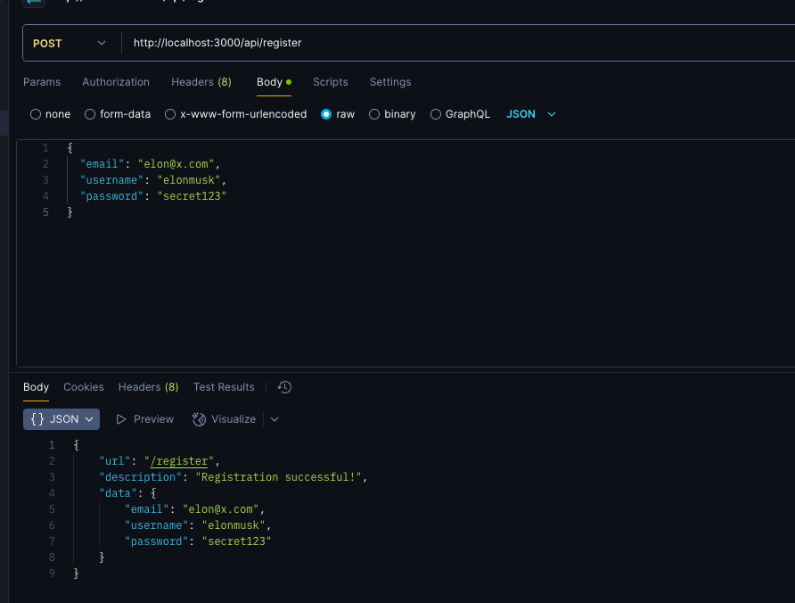
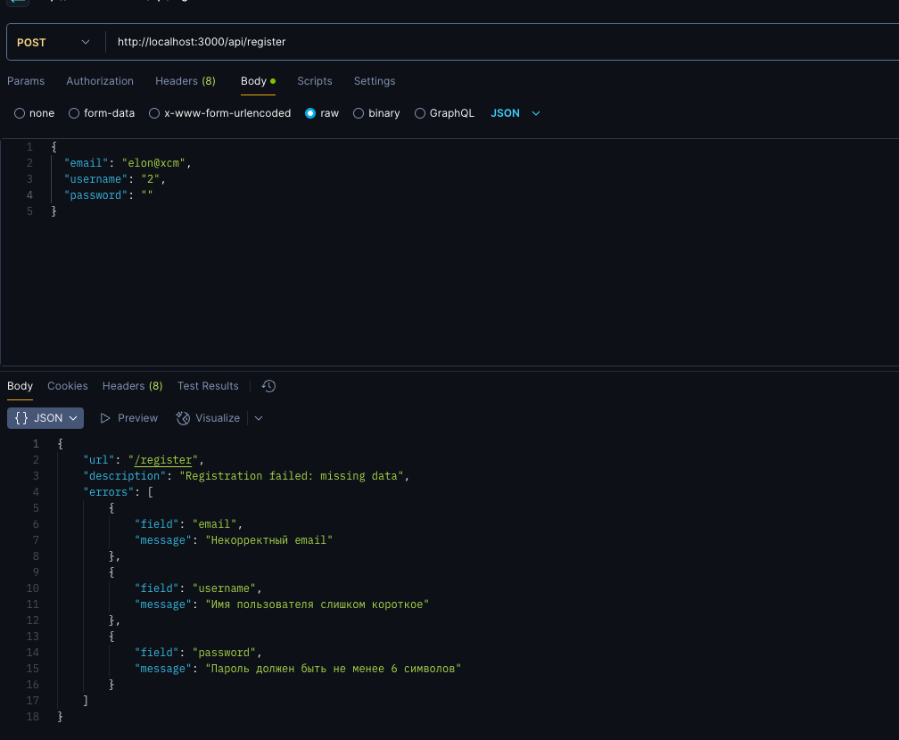

# TaskExpressHttp

## Описание проекта

Проект TaskExpressHttp представляет собой веб-приложение, разработанное с использованием Node.js и Express, которое предоставляет функциональность регистрации пользователей. Основная цель приложения — обеспечить безопасный и удобный процесс регистрации, а также обработку ошибок, которые могут возникнуть в этом процессе.

## Структура проекта

- **src/**: Основная папка с исходным кодом приложения.
  - **app.ts**: Главный файл приложения, который настраивает сервер Express, подключает middleware (cors, body-parser) и маршруты (authRouter).
  - **utils/**: Папка, содержащая вспомогательные функции и схемы валидации.
    - **validation.ts**: Файл, в котором определена схема валидации для регистрации пользователей с использованием библиотеки Zod. Он проверяет корректность введенных данных (email, username, password) и возвращает ошибки, если они есть.
  - **router/**: Папка, содержащая маршруты приложения.
    - **auth.ts**: Файл, который обрабатывает маршруты, связанные с аутентификацией и регистрацией пользователей.

- **photo/**: Папка, содержащая изображения, связанные с процессом регистрации.
  

  <h3>Успешная регистрация</h3>
  
  
  <h3>Ошибка валидации</h3>
  

## Как работает проект

1. **Запуск сервера**: При запуске приложения сервер Express начинает прослушивать указанный порт, который определяется в переменной окружения `PORT`.
2. **Обработка запросов**: Приложение использует middleware для обработки JSON-запросов и CORS, что позволяет клиентам взаимодействовать с сервером.
3. **Регистрация пользователей**: Пользователи могут отправлять свои данные для регистрации, которые проходят валидацию с помощью схемы, определенной в `validation.ts`. Если данные корректны, пользователь успешно регистрируется; в противном случае возвращаются ошибки.
4. **Обработка ошибок**: В случае возникновения ошибок во время регистрации пользователи получают соответствующие сообщения, которые помогают им исправить введенные данные.

Таким образом, проект TaskExpressHttp обеспечивает надежный и удобный процесс регистрации пользователей с ясной структурой и обработкой ошибок.
